

## Initial Steps

The system should always be on - never turn the Vicon off.

Enter the control room. Contact DASC lab for the password if the door is locked.

Straight ahead is the Vicon computer. If it is asleep, wake it up. Never turn this computer off. Open the Vicon software if it’s not already open.

It is a good idea to recalibrate every so often since the cameras can get bumped. If a camera is bumped, it will show up with a red icon as shown in the picture in the System Settings tab on the left.

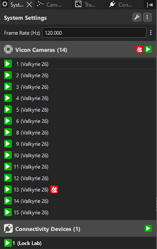

## Masking

Ensure there are no markers visible to the system by looking at the 3D View.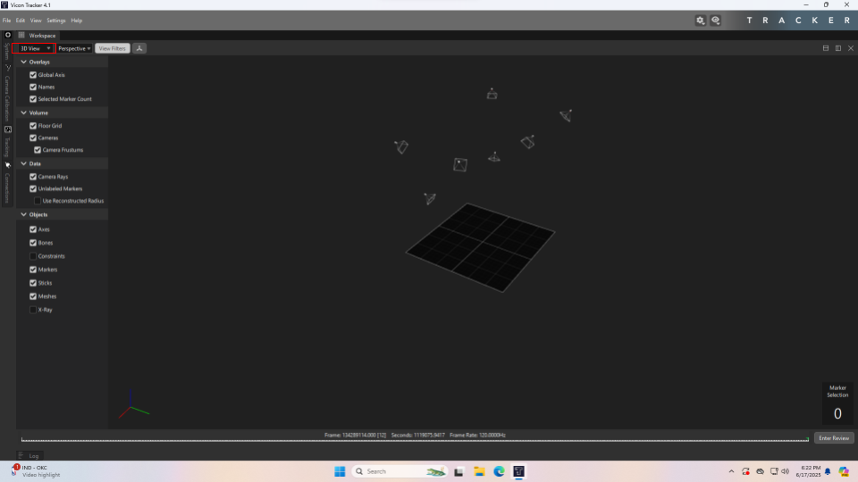
The image below shows what it looks like when there are markers in view of the cameras.
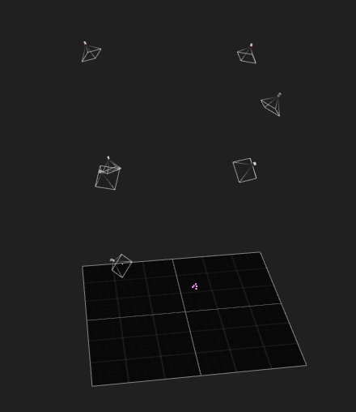

Open the Camera Calibration tab on the left side of the screen and open the Cameras view.

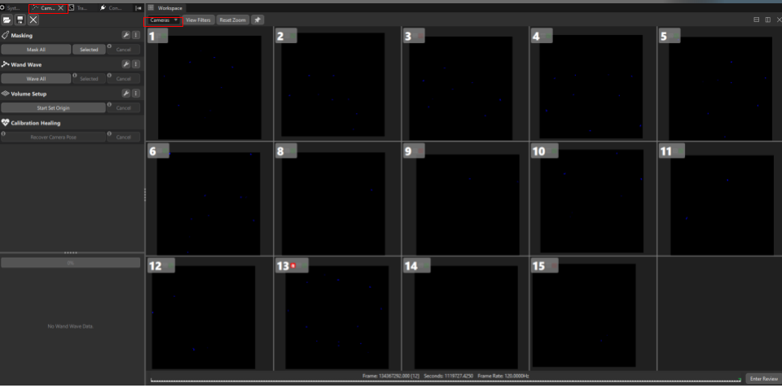

Click Mask All. You should see the dots change from light blue to dark blue. When the lights have settled like in the picture below, click Stop.

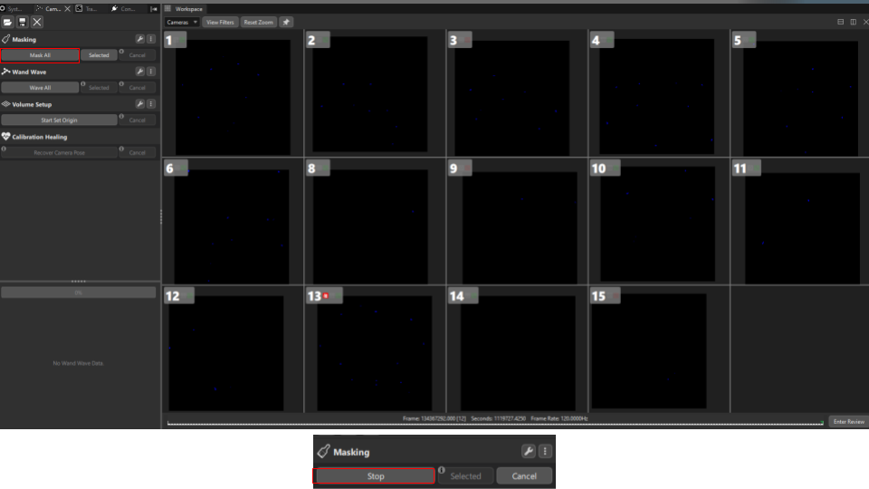

Masking is now complete.

## Waving the Wand

Grab the wand on top of the computer

Turn it on with the switch. Ensure it is in Continuous mode.

If the battery is low, charge it with the cable attached to the computer before using it.

Now in the Camera Calibration tab, click the settings icon to check that Auto-Stop is enabled for the wand, and that the rest of the settings match the picture below. Then click Wave All.

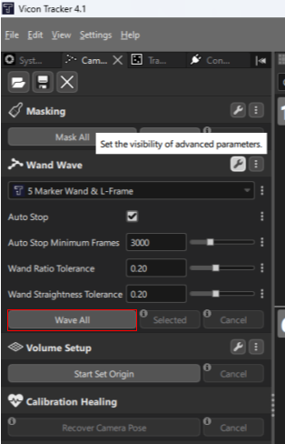

The screen will now look like this:

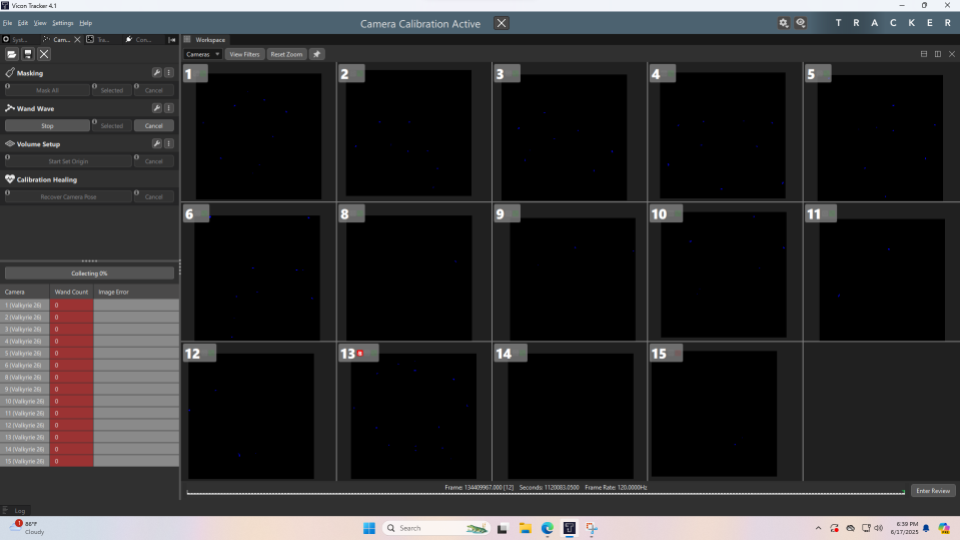

Each camera needs to receive 3000 wand frames to have a robust calibration, and you will achieve this by waving the wand in the general direction of each camera. Once each camera has seen enough frames, the process will auto-stop.

Out in the FlyLab space, wave the wand around like you are washing a window. Make sure to wave it in the direction of each camera, until all of the lower cameras have filled their progress bars and shine a green light

Here is an example of the progress bar on this camera. The red light will turn green once the progress bar is full. By waving the wand in all 6 axes of motion (3 translational and 3 rotational), you will eventually complete the progress bar.

During this process, the computer screen will also show the status of each camera

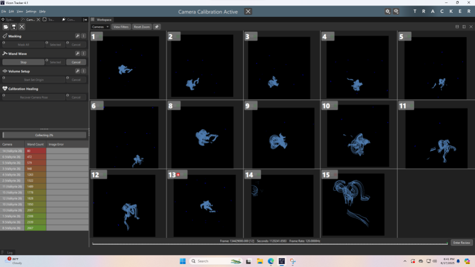

To get the upper cameras, we attach the wand to a rope, located next to the control room door.

Untie the rope from the anchor and lower the end of the rope to ground level.

Then attach the wand through the 3D printed attachment and make sure it is secured.

Raise the wand using the rope and shake the rope up and down to make the wand jump and spin around to get enough coverage on each upper camera.

Each upper camera will light up green once it has seen enough frames.

Once all cameras have enough detections, the calibration should auto-stop and all camera lights will turn red as shown below, indicating normal operation.

The computer screen will look like this

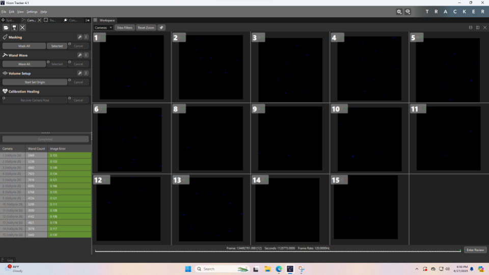

## Setting the Origin

After the wand waving process, the origin of the Vicon coordinate frame needs to be set. Go back to the 3D View and you will see that the default origin has been placed at a camera.

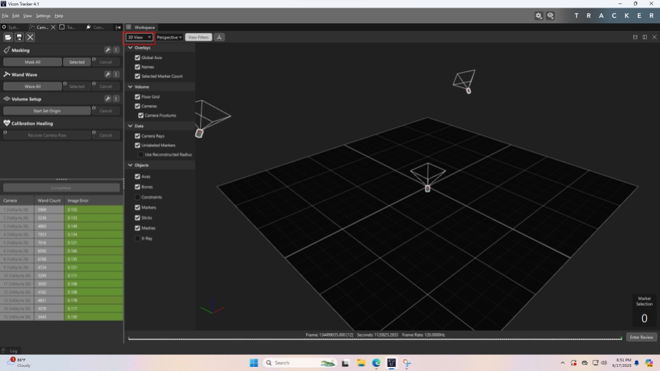

Take the wand and place it in the yellow tape in the FlyLab.

Pan and zoom (left click and right click while moving the mouse) in the 3D View to ensure the wand markers are visible, then click Start Set Origin, then right after click Set Origin.

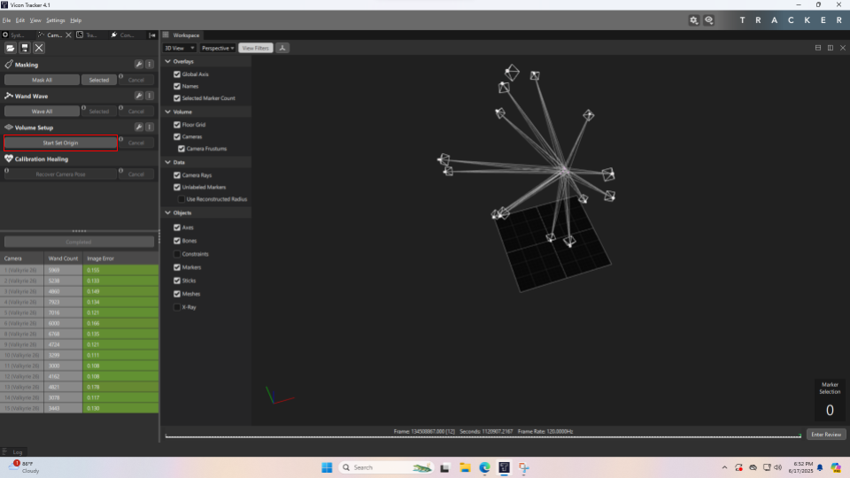

The origin has now been set at the wand's location, which you can verify in the 3D View.

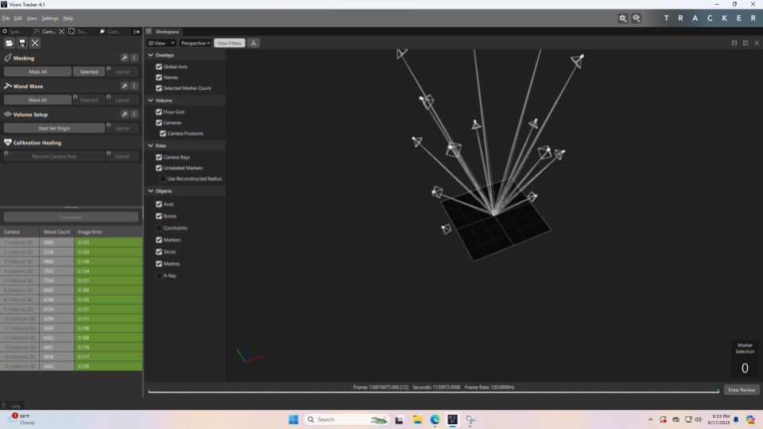
