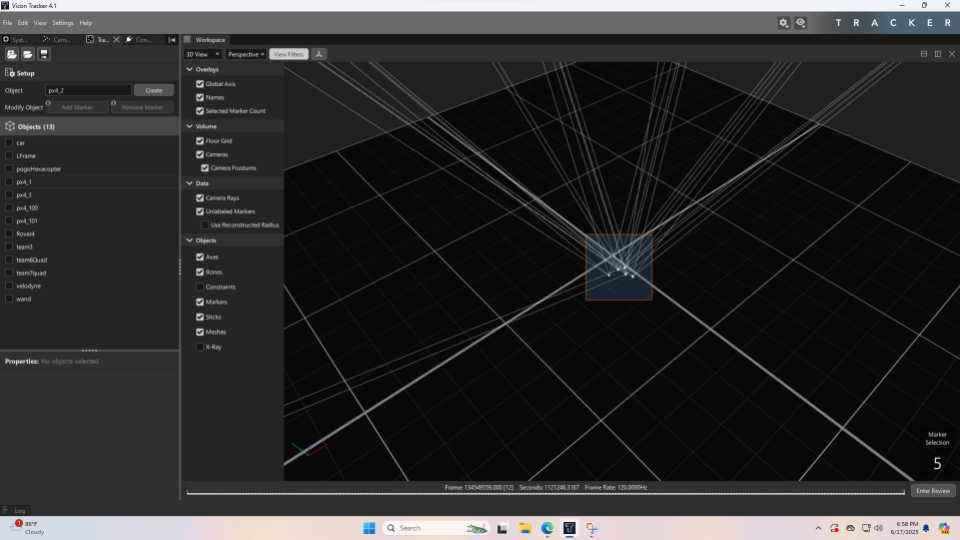

## Making Objects

To add your robot to the list of trackable objects, click on the Tracking tab on the left. Place your robot with the markers on the floor of the FlyLab. Make sure that the marker positions are not symmetrical to allow the Vicon to compute the attitude of the robot.

Hold Alt and click and drag to select all the markers on your object

Enter a unique name for your object and click Create. Your object will now appear in the list of objects.

## Bounding the workspace

Move your robot around in the FlyLab to determine the bounds of the Vicon camera visibility by finding where the system can no longer track the object. Record these bounds and use them in your experimental design to ensure that the robot does not move out of visibility.

