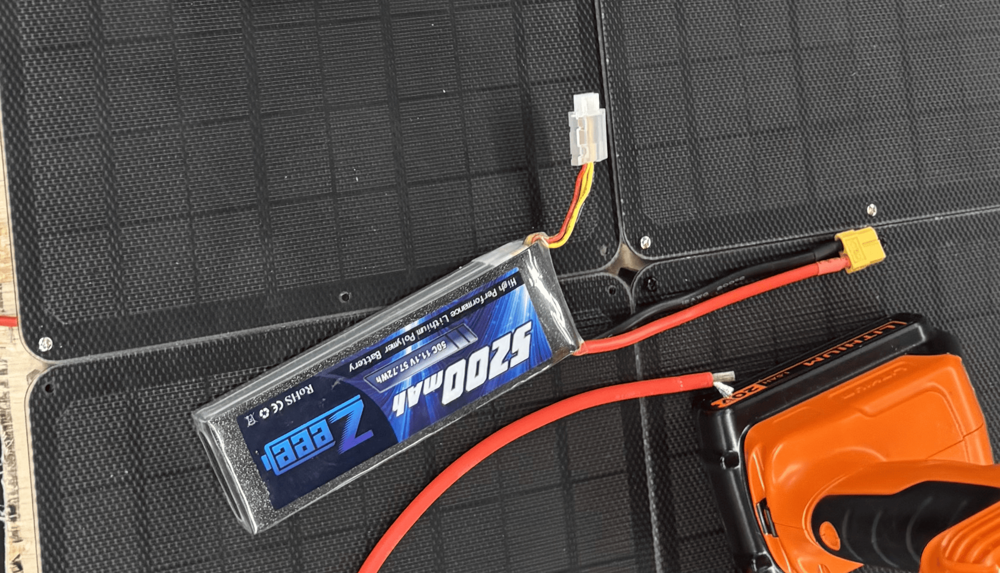
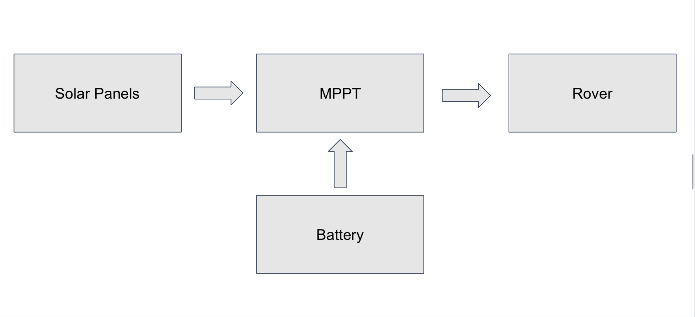

# Solar Rover Setup

## Solar rover & components 

**Solar Rover** 


**Components:**

**12V Battery with an XT60 connection**


**Solar Panels**


**MPPT**


## Solar panel specifications 

Voltage: 18v

Watts: 9w

Current: 0.5 amps

## Current solar panel configuration  

**Distinction between parallel and series connections (solar panels):**

- **Series connection:** Increases the voltage.  
  - For the rover, this was unnecessary since the battery operates at 12V and each solar panel operates at a voltage raving above 12v.  

- **Parallel connection:** Increases the current.  
  - Since the battery’s voltage requirement is already satisfied, the panels must be connected in parallel to provide the necessary current.  

To power the rover’s electronics, especially the motors, all solar panels are wired in **parallel**.  

**Simplified solar rover wiring diagram:**  


## Solar rover dimensions & max speed 

Length: 16 inch

Width: 8.5 inch

height: 4.5 inch

Max speed: 1 m/s

## Solar panel configuration specifications

Total surface area: 0.549918 m^2

Idle current yeild: 4.5 amps 

## Solar rover energy specfications

Total energy capacity: 207,792 J

Idle discharge: approximately **0.50 A**

Moving discharge: **2 A** 


## Turning on the solar rover  

**Warning:**  
The battery must be connected to the MPPT *before* the solar panels, otherwise the MPPT could be damaged.  

### Steps:  

1. Connect the battery to the MPPT using the XT60 connectors.  
2. Connect the solar panels to the MPPT using the XT60 connectors. *(Optional, only if you want to use the panels.)*  
3. Connect the load (the rover) to the MPPT via the XT60 connector.  
4. Press the right arrow button on the MPPT to activate discharging/charging.  
   - The MPPT will display the current drawn from the battery and the current generated by the panels.
5. Once completed, you should see these icons on the MPPT:  
   -   


## Connect to the solar rover

Info: The solar-rover already has all of the necessary repositories already therefore you will only need to clone groundstation_cps_solar repo on your laptop.

1. Clone the groundsation_cps_solar repository.

```
git clone https://github.com/dasc-lab/groundstation_cps_solar

```
2. Connect the Raspberry Pi to an external screen, and connect a keyboard

3. Give the raspberyy-pi inside the rover a few minutes to boot, allowing it to establish an ssh server.
    -  Once the ssh server is establied, we can remotely control the solar rover via the terminal. 

4. Using the hostname -I command, you can grab the PI's IP and connect to it 

```
ssh (solar rover IP)

```

6. Once connected, cd into the px4_jumpstart folder inside the PI


```
docker compose build

```

```
docker compose up -d

```

```
docer exec -it (tab twice for it to fill with the exec docker file) bash

```

7. Once inside the container, run command to send your pose to the vicon system within the lab 

```
ros2 launch all_lauch px4.launch.py 

```

## Summary of connect to solar-rover 

(Laptop) Run the docker and launch `gs.launch.py`

```
$ git clone https://github.com/dasc-lab/groundstation_cps_solar
$ cd groundstation_cps_solar
$ docker compose build
$ docker compose up -d
$ docker exec -it <Container-name> bash
$ ros2 launch ground_station_launch gs.launch.py

```

(Raspberry PI)  Run the docker and launch `PX4.launch.py`

```
$ cd rover_px4_jumpstart_ros2_jumpstart
$ docker compose build
$ docker compose up -d
$ docker exec -it <Container-name> bash
ros2 launch all_launch px4.launch.py

```