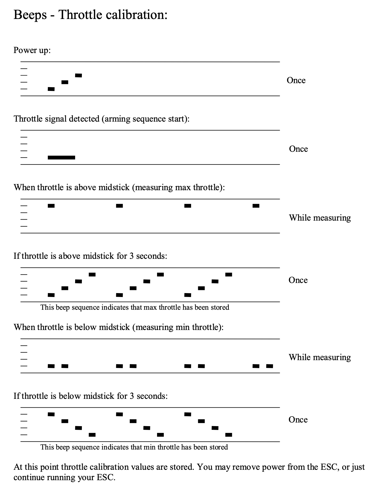
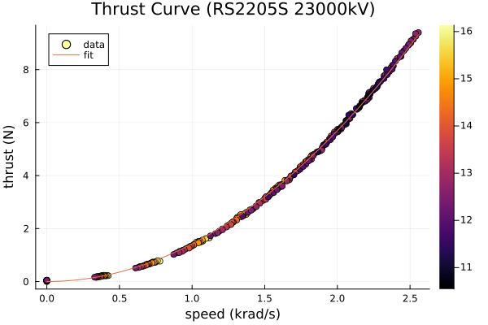
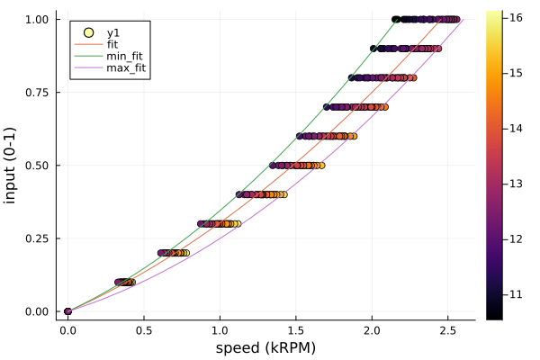
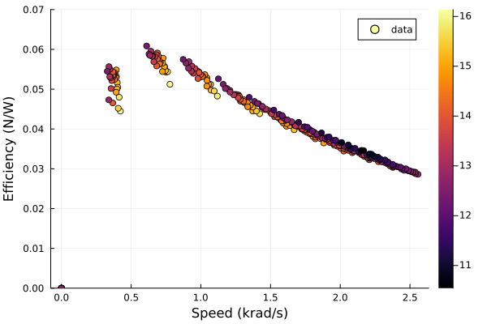

# Vision Drone Motor Calibration Guide
This explains how the motor coefficients were obtained experimentally. 

$$
\begin{aligned}
x + y = z
\end{aligned}
$$

# Data Collection

We used the RC Benchmark 1520, mounted with the desired prop, motor and esc. In this document we used
- prop: 5045 triblade
- motor: Emax RS2205S 2300kV
- ESC: HAKRC 45A 2-6S BLHeli_S 4-in-1 ESC

After downloading the RCBenchmark tool on a windows computer (Linux and MacOS didnt work), we did the following:
- set the correct number of poles (in this case, 14, since it is a 12N14P motor)
- calibrate the load cell
- tare the thrust
- maximize all the settings of the safety cutoffs
- ensure the esc is calibrated (see below)
- check the esc is responding correctly using the manual control sliders
- put on the props
- run the discrete steps script
- run the rise time script

## Calibrating the ESC
After removing the props, we first checked that the esc was calibrated correctly. This means that 1000μs should correspond to min-throttle, and 2000μs corresponds to max throttle. 
To calibrate the ESC, follow the following steps:
- disconnect esc battery power
- in the manual control tab, ensure the check boxes are off.
- drag the slider to the max value of 2000
- power on the esc
- after hearing the correct beeps, lower the throttle to the min value of 1000 us
- after hearing the correct beeps, disconnect power from the esc. 

The "beeps" are an auditory signal that tells you what the esc is thinking. This diagram (from [this link](https://github.com/4712/BLHeliSuite/blob/master/Manuals/BLHeli_S%20manual%20SiLabs%20Rev16.x.pdf)) explains what you should hear:

## Collected Data

The data collected has been included in this repository. Find it here: [https://github.com/dasc-lab/robot-framework/tree/master/docs/vision_drone](https://github.com/dasc-lab/robot-framework/tree/master/docs/vision_drone)

## System Model

We will model the motor output as 

$$
T = k_T \omega^2
$$

and

$$
u = (1 - \alpha) \frac{\omega}{\omega_{max}} + \alpha \left(\frac{\omega}{\omega_{max}}\right)^2
$$

where
- $$T$$ is the thrust in N
- $$\omega$$ is the motor speed in kilo-rad/s
- $$u \in [0, 1]$$ is the (normalized) PWM command to the motors

with coefficients
- $$\omega_{max}$$ is the max motor speed in kilo-rad/s
- $$k_T$$ is the thrust coefficient in N / ( kilo-rad/s)^2
- $$\alpha \in [0, 1]$$ is the ESC nonlinearity coefficient

The $$\omega_{max}$$ depends on the battery voltage, and therefore this model will not capture all the effects.

## Data Analysis

From the data, we can plot the following relationships. In each plot, the marker color is based on the measured voltage.

Thrust Curve

Speed Curve:

Power Curve:

Efficiency Curve:

Clearly, the thrust curve is independent of the battery voltage, as expected. 
The speed curve has some battery voltage dependency.

After running the datafits, we get the following table of results:

| Parameter | Value | units |
| ---------- | ------- | ------- |
| QUAD_KTHRUST |     1.4238 | N / (krad/s)^2 | 
| QUAD_OMEGA_MAX (high battery)	| 2.60232 | krad/s | 
| QUAD_OMEGA_MAX (nominal) | 2.45426 | krad/s | 
| QUAD_OMEGA_MAX (low battery) | 2.16703 | krad/s | 
| QUAD_ESC_NONLIN (high battery) | 0.568215 | 	- | 
| QUAD_ESC_NONLIN (nominal)	| 0.429347 | 	- | 
| QUAD_ESC_NONLIN (low battery)	| 0.467502 | 	- | 

