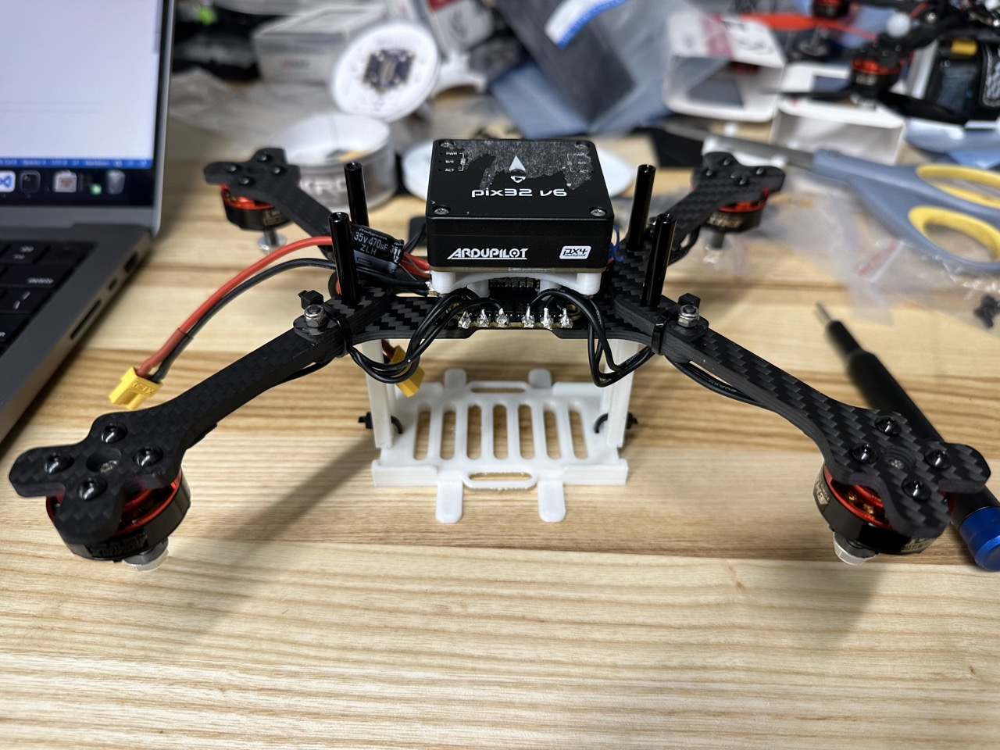

# Vision Drone Complete Guide
This is a complete guide about building and operating the vision drone from scrach.

# Frame and Hardware Assembly

## ESC Assembly
Prepare the following items:


Solder the capacitor, power cable into the ESCs. **Pay attention to the front and back of the ESC.**


Prepare the following items:


Solder the power cable.


Install the ESC into the frame with M2.5*20 screw. **Pay attention to the front and back of the ESC.**


Install arms.


Install motors.


Solder motor wire to ESC.


## Pix32 Preparation
**Before assembly: Upload custom firmware to Pix32. Calibrate the Acc, Gyro and compass.**


Insert the nut into the Pix32 stands. **Set iron to 200 degrees**


Prepare the following items:


**Due different motor ordering with 4 in 1 ESC and PX4, we need to remap the channel.**


ESC wiring table:

| ESC   | CUR | NC | 4 | 3 | 2 | 1 | + | - |
| Pix32 | I   | NC | 4 | 2 | 1 | 3 | V | G |


Solder it: **Do not reference to the image, use the wiring table**


Install the pix32 support with **M2*12**:


Connect the cable:


Install into the frame:


## Battery stands and Xavier Assembly
Install the battery stands, **replace bottom M3 strew with M3*16**:



Install Xavier support:


Install Xavier:


Install WiFi module:


Install Xavier module:


- The steps are same for assembling Jetson Orin instead of Xavier. Just use the `A603` carrier board instead of the carrier board `A203` used for Xavier. 


# PX4 Configuration Guide 
- For the purpose of checking the motors and calibrating the sensors, flash the default PX4 firmware using QGC on the Pix32 V6.

## Setup Dshot and test motors
- **Make sure the propellers are removed for this setup and throughout testing the motors.**
- set `SYS_USE_IO` to `IO_PWM_DISABLE`
- set `DSHOT_CONFIG` to `DShot600`
- Verify motor order using Mavlink console `dshot beep1 -m [Motor number]`
- Verify motor spinning direction
- Use the following command to reverse motor `dshot reverse -m [Motor number]`, `dshot save -m [Motor number]`
- Motors can be checked individually inside the /Vehicle Setup/Motors tab inside the QGC.  

## Flashing the custom PX4-Autopilot-Quad
- First clone the PX4-Autopilot-Quad 
- Run the following commands to make sure that px4 build will recognize the tags:
```
$ cd /PX4-Autopilot-Quad
$ git submodule update --init --recursive
$ git remote add upstream https://github.com/PX4/PX4-Autopilot.git
$ git fetch upstream --tags
```

- Then build and run the docker using the following commands. (If you cant find docker files in the main branch switch to the branch KBN)
```
$ docker compose build
$ docker compose up -d
$ docker exec -it <container-name> bash
```

- Make the px4 version using the following command inside the docker in /home/px4
```
$ make px4_fmu-v6c_dasc
```

- Flash the `px4_fmu-v6c_dasc` using the QGC.

## PX4 Parameter (old version 1.13)
- Set `MAV_SYS_ID` to be a different value from other Drone (match number with name of drone)
- Set `Hold` and `Offboard` for `COM_RCL_EXCEPT`
- in `EKF2_AID_MASK`: Check `GPS`, `vision position fusion`, and `vision yaw fusion` if outdoor, and **only** `vision position fusion` and `vision yaw fusion` if indoor
	- NOTE: Code for vision position fusion is different whether or note use GPS is checked
- Set `EKF2_HGT_MODE` to GPS if doing outdoor testing and Vision if doing indoor testing
- Set `EKF2_GPS_P_NOISE` to 0.2 m
- Set `EKF2_GPS_V_NOISE` to 0.15 m/s
- set `MAV_0_RATE` to 0 B/s (i.e. unlimited data sending rate)
- set `COM_RC_IN_MODE` set to joystick only
- set `MAV_0_RADIO_CTL` to disable
- set `SER_TEL1_BAUD` to 115200 8N1
- set `RTPS_CONFIG` to TELEM 2
- set `SER_TEL2_BAUD` to 921600 (might need to reboot vehicle to see this option)

## PX4 Parameter (new v1.14)
- Set `MAV_SYS_ID` to be a different value from other Drone (match number with name of drone). This number matches the number in the name `px4_#`. The current custom firmware PX4-Autopilot-Quad requires the robot name to be in the format  `px4_#`. Here `#` is the `MAV_SYS_ID`.
- Set `Hold` and `Offboard` for `COM_RCL_EXCEPT`
- Set `EKF2_EV_CTRL` to 15 (check all boxes)
- Set `EKF2_HGT_MODE` to GPS if doing outdoor testing and Vision if doing indoor testing
- Set `EKF2_GPS_P_NOISE` to 0.2 m
- Set `EKF2_GPS_V_NOISE` to 0.15 m/s
- set `MAV_0_RATE` to 0 B/s (i.e. unlimited data sending rate)
- set `COM_RC_IN_MODE` set to joystick only
- set `MAV_0_RADIO_CTL` to disable
- set `SER_TEL1_BAUD` to 115200 8N1
- set `XRCE_DDS_CONFIG` to TELEM2 (reboot after this)
- set `SER_TEL2_BAUD` to 921600 (might need to reboot vehicle to see this option)
- set `EKF2_MAG_TYPE` to None (disables mag, requires reboot)


## QuadControl Parameters(Updated 06/19/2024)
- Set `QUAD_ESC_NONLIN` to 0.500 
- Set `QUAD_KOMEGA` to 0.120 kOmega
- Set `QUAD_KR`t o 0.900 kR
- Set `QUAD_KTHRUST` to 1.370 (N / (kilo-rad/s)^2)
- Set `QUAD_KTORQUE` to 0.190 (Nm / (kilo-rad/s)^2)
- Set `QUAD_KV` to 4.0 kv
- Set `QUAD_KX` to 7.0 kx
- Set `QUAD_M` to 0.680 kg. Update this based on the mass of your quadrotor
- Set `QUAD_OMEGA_MAX` to 2.520 krad/s


# Setting up Orin or Xavier
-  First, use the SDK manager to flash the Orin

-  Connect the Orin with the carrier board to the host computer using the USB A-to-micro cable. Also, power the Orin carrier board using the power supply instead of the battery.

-  At this point, you might encounter the following scenarios:
	- The SDK manager successfully detects the board. In this case, proceed to next step.
	- The SDK manager does not detect the board. In this case, you need to force the Orin into recovery mode. For the Orin carrier board A603, recovery mode can be initiated by shorting 3 and 4 in W7. Please refer to the picture and this document for more details: [A603 Documentation](https://files.seeedstudio.com/products/NVIDIA/A603-Carrier-Board-for-Jetsson-Orin-NX-Nano-Datasheet.pdf). If using Xavier with the carrier board A203, recovery mode can be initiated by shorting 6 and GND (1,2,3,4). [A203 Documentation](https://wiki.seeedstudio.com/reComputer_A203_Flash_System/)

	[TODO: Add picture]

-  In the target components, select Jetson Linux only. You don't need to select Jetson Runtime Components as we will mostly be working inside the Docker container. Accept the terms and continue.

-  In the SETUP PROCESS:
   - Choose Automatic Setup in the `Recovery mode setup`. 
   - Keep the default IP address. 
   - If this is the first time, then enter  `username: ubuntu` and  `password: hello123`. We keep this consistent across all modules. 
   - If this is not the first time the Orin is being flashed, then enter the current username and password, and make sure the new username and password match the details given above. You can provide a new username and password by unchecking the `Use current username/password` box.
   - Select the `Storage Device` as NVMe. This is becasue we are flashing on the SSD.

- The flash can fail due to a bad Orin, carrier board, or SSD. Make sure to check each component.

- After booting up the Orin, change the hostname permanently to `orin#` such that `username@hostname = ubuntu@orin#`. The number `#` should be selected after checking all numbers on the active orin modules. Follow these commands to change the hostname permanently:
```
$ hostname
$ sudo hostnamectl set-hostname NEW_HOSTNAME
```
- Reboot and check if the hostanme has been set successfully.

- In order to SSH into the orin remotely, set the first line of `/etc/hosts` to 
```
127.0.0.1 $HOSTNAME
```

- To SSH into the Orin remotely, use following commands:
```
$ ssh ubuntu@orin#.local
$ password: hello123
```

- Then run the flash.sh inside the Orin once it is ready. The flash file can be found [here](https://github.com/dasc-lab/rover_px4_ros2_jumpstart/blob/trajectoryfollower/flash.sh). Consider removing `sudo apt-get upgrade` as it has previously deleted Kernel. The flash file can be executed using following commands
```
$ chmod +x path/to/flash.sh
$ ./flash.sh
```

- Generate a new SSH key for github ([Link](https://docs.github.com/en/authentication/connecting-to-github-with-ssh/generating-a-new-ssh-key-and-adding-it-to-the-ssh-agent)). Or follow these commands and then copy the key from the last command to the github account
```
git config --global user.email "your_email.com"
git config --global user.name "username"
ssh-keygen -t ed25519 -C "your_email.com"
eval "$(ssh-agent -s)"=
cat ~/.ssh/id_ed25519.pub
```

- Clone the px4-jumpstart repository and build the docker file.  

```
$ git clone https://github.com/dasc-lab/rover_px4_ros2_jumpstart.git
$ cd rover_px4_ros2_jumpstart
$ docker compose build
```

- The docker-compose.yaml can be changed accordingly if required. At a minimum, it should contain the following:

```
version: "3"
services:
  ros:
    build: .
    privileged: true
    tty: true
    network_mode: "host"
    volumes:
       - ./colcon_ws:/home/colcon_ws
       - /tmp/.X11-unix:/tmp/.X11-unix
       - $HOME/.Xauthority:/home/admin/.Xauthority:rw 
    environment:
      - DISPLAY=$DISPLAY
      - FASTRTPS_DEFAULT_PROFILES_FILE=/home/colcon_ws/rtps_udp_profile.xml
      - ROS_DOMAIN_ID=4
```


- The Seeed Studio A603 carrier board for the NVIDIA Orin NX has an issue with the kernel drivers for usbserial. Essentially, instead of using the usbserial.ko for the board which are modified by Seeed, the default usbserial.ko is used. This causes the FTDI driver to not work as expected. The solution is to move the usbserial.ko file which causes the new file from Seeed Studio to be used. Use `dmesg | grep tty` to check if the tty/UAB0 and tty/USB1 are successfully detected. 

```
$ cd /lib/modules/5.10.120-tegra/kernel/drivers/usb/serial/
$ sudo mv usbserial.ko usbserial.ko.bk
```

- Configure the `colcon_ws//src/all_launch/config/mavlink-router.conf file`. The `Address` should match the ip address of your computer running the QGC. The ip address can be checked by running `ifconfig`

```
[UartEndpoint alpha]
Device = /dev/ttyUSB0
Baud = 115200

[UdpEndpoint alpha]
Mode = Normal
Address = <host_computer_ip> 
Port = 14550
```

- Configure the `/colcon_ws/src/all_launch/launch/px4.launch.py` such that the microXRCE_bridge uses `/dev/ttyUSB1` and the `robot_name = "px4_#`, where the `#` matches the `MAV_SYS_ID` in the QGC parameters. 


# First flight

- Make sure that the drone is properly tethered.
- To avoid any crashes, start with a quarter of the original quadrotor mass, i.e., `QUAD_M/4`. This will provide less thrust than required for the drone to lift. Slowly increase the mass to the correct value once the motors are confirmed to be working fine. 
- Consider using the [px4 Flight Review](https://review.px4.io/upload) to debug. 

## On Orin

Run the docker and launch the `px4.launch.py`

```
$ docker compose up -d
$ docker exec -it <Container-name> bash
$ ros2 launch all_launch px4.launch.py
```

## On ground station 

Run the docker and launch the `gs.launch.py`

```
$ git clone git@github.com:dasc-lab/rover_groundstation_ros2_jumpstart.git
$ cd rover_groundstation_ros2_jumpstart
$ docker compose build
$ docker compose up -d
$ docker exec -it <Container-name> bash
$ ros2 launch ground_station_launch gs.launch.py
```

# Docker Setup Guide
The xavier nx modules only come with 16 gb of disk. This is not enough to run most things, so we move the docker default directory to a mounted sd card. 
1. See https://www.ibm.com/docs/en/z-logdata-analytics/5.1.0?topic=compose-relocating-docker-root-directory for how to move the default directory
2. Next, make sure the sd card is mounted on boot to the same directory everytime. See https://serverfault.com/questions/1046440/auto-mount-several-sd-cards-one-after-the-other-to-the-same-directory

